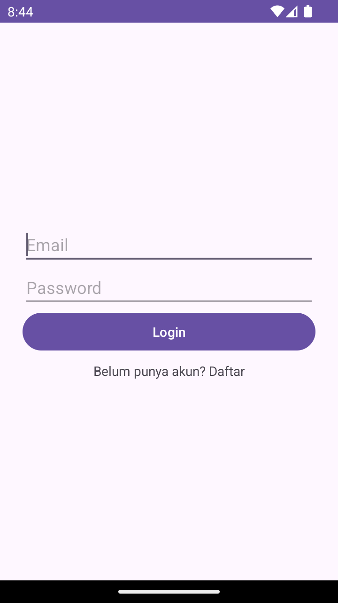
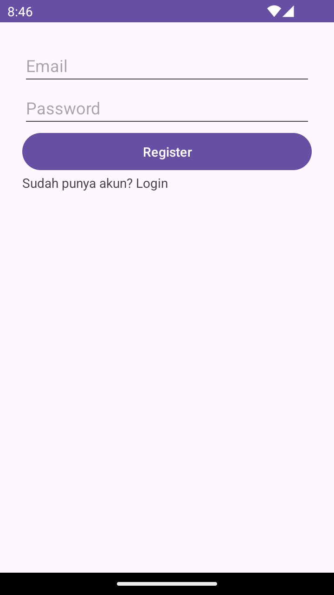
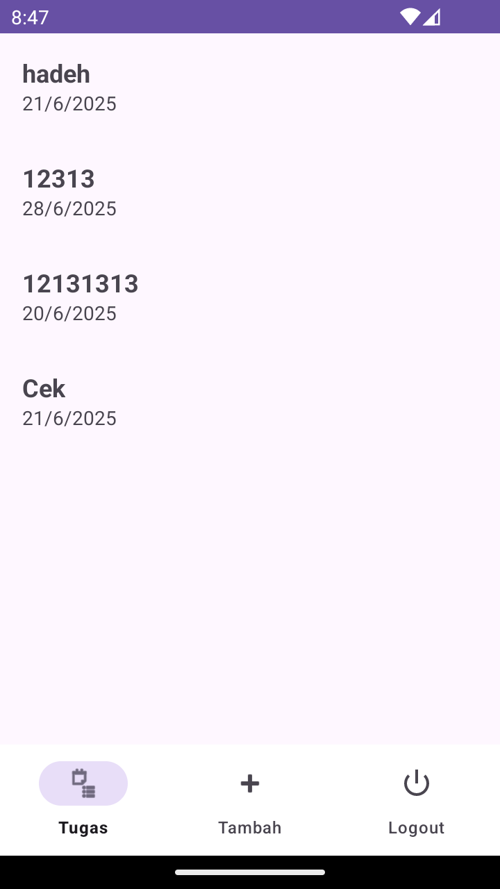
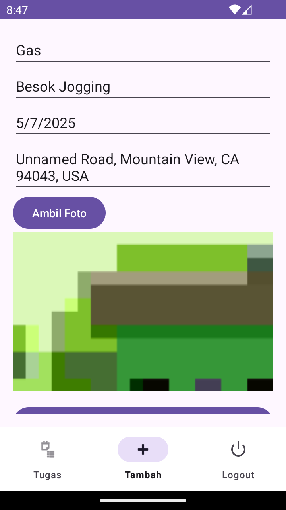

# 📱 TaskMasterApp

TaskMasterApp adalah aplikasi Android sederhana yang dirancang untuk membantu pengguna mengatur, melacak, dan menyelesaikan tugas-tugas harian dengan mudah. Aplikasi ini dibangun menggunakan Android Studio dan bahasa pemrograman Java, dengan tampilan yang modern dan fungsionalitas yang lengkap.

---

## 🎯 Fitur Unggulan

- ✅ **Login dan Register** (dengan autentikasi)
- 📝 **Tambah, Edit, dan Hapus Tugas**
- 📋 **Daftar Tugas Harian**
- 🕓 **Pengingat Tugas (Notifikasi)**
- 💬 **Chat Tugas**
- 🔄 **Navigasi Fragment (Login, Register, Add Task, List Task)**
- 🔐 **Logout**
- 🌙 **Dark Mode (opsional tergantung sistem)**

---

## 📸 Screenshot Aplikasi

| Login | Register | Beranda | Tambah Tugas |
|-------|----------|---------|---------------|
|  |  |  |  |


---

## ⚙️ Teknologi & Library

- **Java**
- **AndroidX + Material Design**
- **Fragments + ViewModel**
- **RecyclerView**
- **Notification Manager**
- **Custom Adapter**
- **Intent, Bundle, Toast**

---

## 🔧 Cara Menjalankan

1. Clone repository ini:

    ```bash
    git clone https://github.com/FieveK/TaskMasterApp.git
    ```

2. Buka dengan Android Studio
3. Tunggu Gradle sync selesai
4. Jalankan project di emulator atau perangkat Android

---

## 📦 Download APK

➡️ [Klik di sini untuk mengunduh APK](https://github.com/FieveK/TaskMasterApp/releases)  
Pastikan mengaktifkan **Install Unknown Apps** di perangkat kamu.

---

## 👨‍💻 Developer

**Muhammad Yudi Fitriyadi**  
🆔 2210131310005  
🎓 Pendidikan Komputer - FKIP ULM  
📘 Praktikum: **Pemrograman Perangkat Bergerak – Semester 6**

---

## 📄 Lisensi

Project ini dibuat untuk keperluan pembelajaran. Bebas digunakan dan dimodifikasi untuk keperluan pribadi atau pendidikan.

---

## 🙏 Terima Kasih

Terima kasih kepada dosen pengampu dan rekan-rekan seperjuangan praktikum yang telah mendukung proses pengembangan aplikasi ini.

---

